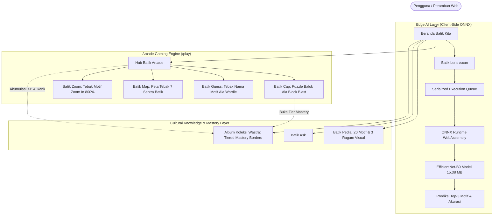

# Batik Kita — Platform Edukasi Budaya & AI Cultural Experience

<div align="center">


### *Warisan Luhur Nusantara dalam Sentuhan Inovasi Digital*

[-black?style=for-the-badge&logo=next.js)](https://nextjs.org/)
[](https://react.dev/)
[](https://tailwindcss.com/)
[](https://onnxruntime.ai/)
[](https://www.docker.com/)
[](https://hology.ub.ac.id/)

</div>

---

## 🌟 Sekilas Tentang Batik Kita

**Batik Kita** adalah platform edukasi budaya interaktif berbasis kecerdasan buatan (*Artificial Intelligence*) yang mentransformasikan cara generasi muda mempelajari, mengapresiasi, dan melestarikan seni wastra batik Nusantara (Warisan Budaya Takbenda UNESCO sejak 2009).

Melalui perpaduan harmonis antara **Edge AI Computer Vision langsung di peramban web**, **Edu-Games Arcade Berbasis Gamifikasi**, **Ensiklopedia Batik Pedia**, asisten kultural **Batik Ask**, serta **Album Koleksi Motif** dengan sistem bingkai kemahiran (*mastery borders*), Batik Kita menghadirkan pengalaman belajar yang imersif, ilmiah, dan berakar pada filosofi luhur bangsa.

---

## 🏛️ Arsitektur Ekosistem Fitur (Batik Suite)

Seluruh layanan di dalam Batik Kita dirancang secara modular dan menggunakan tata nama rute (*clean URL design*) yang intuitif:

| Fitur | Rute URL | Tipe Layanan | Penjelasan & Gameplay |
| :--- | :--- | :--- | :--- |
| **Batik Lens** | `/scan` | Edge AI Vision | Pemindai motif batik berbasis **EfficientNet-B0 ONNX WebAssembly**. Inferensi 100% lokal pada peranti klien tanpa mengirim data foto ke server luar, dilengkapi **Audio Guide Museum berbahasa Indonesia alami** (`/api/tts` stream & Web Speech fallback). |
| **Batik Arcade** | `/play` | Hub Game Edukasi | Hub utama arena game batik dengan sistem akumulasi XP dan 4 tingkatan peringkat (*Pelajar Budaya* hingga *Empu Batik Digital*). |
| **Batik Cap** | `/play/cap` | Block Puzzle | Game puzzle balok polyomino ala *Block Blast*; pemain menyusun potongan balok motif ke kisi kanvas dengan meja kerja 3 balok yang otomatis terisi ulang saat dipasang. |
| **Batik Guess** | `/play/guess` | Mode Detektif Budaya | Game deduksi wastra berformat 1 kolom terpusat dengan 4 jenjang petunjuk filosofis, pilihan kartu 2×2, ketik bebas dengan autolengkap, serta bantuan 50:50. |
| **Batik Map** | `/play/map` | Tebak Sentra Peta | Game mencocokkan kartu motif batik ke daerah asalnya di peta interaktif 7 Sentra Batik Nusantara (MapLibre GL). |
| **Batik Zoom** | `/play/zoom` | Uji Hafalan Pola | Game menguji seberapa hafal pemain dengan pola batik dari gambar yang di-zoom in dekat (800%), lalu ditebak sebelum gambarnya perlahan diperkecil (*zoom out*). |
| **Batik Pedia** | `/batikpedia` | Ensiklopedia Digital | Katalog 20 motif resmi tervalidasi budayawan yang memuat filosofi mendalam, asal-usul sentra, klasifikasi corak, panduan etika pakem pemakaian, 3 ragam visual per motif, serta **Audio Storytelling berbahasa Indonesia**. |
| **Batik Ask** | `/chat` | Conversational AI (Dual-Engine) | Asisten dialog interaktif budaya batik dengan **arsitektur dual-engine**: online via Google Gemini 2.5 Flash & otomatis beralih ke **Mode Empu Luring** (offline) jika kuota API habis atau luring. |
| **Album Koleksi** | `/collection` | Progresi & Mastery | Galeri kartu pencapaian wastra berbingkai adaptif (*Dynamic Mastery Borders*): Zamrud, Perunggu, Perak, dan Emas Berkilau Hologram, lengkap dengan fitur dengarkan narasi audio. |

---

## ⚡ Sorotan Rekayasa & Inovasi Teknologi



### 1. In-Browser Edge AI Vision dengan Serialized Queue (Batik Lens)
* **Arsitektur Model:** Backbone **EfficientNet-B0** yang dilatih khusus melalui transfer learning pada 9.240 citra kurasi kain batik Nusantara.
* **Format & Ukuran:** ONNX Opset 14 teroptimasi biner sebesar **~15.38 MB**.
* **Eksekusi Lokal:** Dijalankan langsung pada thread WebAssembly CPU/GPU klien melalui `onnxruntime-web`. Foto pengguna tidak pernah keluar dari peranti.
* **Metrik Evaluasi Independen (300 Citra Uji Acak):**
  * **Top-1 Accuracy:** **97.33%** (292 / 300 prediksi tepat)
  * **Top-3 Accuracy:** **99.00%** (297 / 300 prediksi tepat)
  * **Latensi Inferensi:** ~50–120 ms (bebas latensi jaringan).
* **Serialized Execution Queue:** Diterapkan antrean eksekusi sequential di `onnxClassifier.ts` untuk mencegah *race condition* atau crash sesi WebAssembly concurrent (`Session already started / mismatch`).

### 2. Puzzle Balok Polyomino (Batik Cap)
* **Gameplay Block Puzzle:** Terinspirasi dari mekanisme puzzle balok (seperti *Block Blast*), pemain menyusun potongan-potongan balok batik ke kisi kanvas 6 × 6 hingga motif terbentuk utuh.
* **Partisi Balok Dinamis (BFS):** Potongan balok dipotong secara acak menggunakan algoritma partisi polimino (*Breadth-First Search*), sehingga variasi balok di setiap sesi permainan selalu berbeda.
* **Meja Kerja 3 Balok:** Meja kerja hanya menampilkan 3 balok aktif. Begitu 1 balok dipasang, posisi balok tersebut langsung diisi balok baru dari antrean tanpa perlu repot geser halaman (*no pagination*).
* **Sensitivitas Magnetik Presisi:** Ambang batas tarik magnetik diperketat (`0.85` unit grid) agar balok menempel pas pada rongga yang tepat.
* **Skalabilitas Kesulitan:**
  * **Mudah:** 5–6 kepingan balok (+100 XP).
  * **Menengah:** 8–10 kepingan balok (+150 XP).
  * **Sulit:** 12–15 kepingan balok (+200 XP).

### 3. Mode Detektif Budaya (Batik Guess)
* **Layout Terpusat 1 Kolom:** Mengeliminasi elemen visual statis untuk menghadirkan alur deduksi budaya yang terfokus (*above the fold*) tanpa perlu scroll.
* **4 Jenjang Petunjuk Filosofis:** Petunjuk dibuka bertahap (makna filosofis, sentra asal, ciri visual corak, dan penggunaan tradisi). Semakin sedikit petunjuk yang dibuka, semakin besar reward XP (+100, +75, +50, +25 XP).
* **Dual Input Mode:** Mendukung mode Pilihan Kartu interaktif serta mode Ketik Bebas dengan *live autocomplete* (+20 bonus XP).
* **Fitur Bantuan (*Lifelines*):** Dilengkapi tombol Bantuan 50:50 (mengeliminasi 2 opsi salah) dan tombol Buka Petunjuk berikutnya.

### 4. Peta Tebak Sentra Nusantara (Batik Map)
* Peta interaktif berbasis **MapLibre GL** yang menantang pemain menyeret kartu motif batik dan menempatkannya ke salah satu dari **7 Sentra Batik Nusantara** (*DKI Jakarta, Cirebon, Pekalongan, D.I. Yogyakarta, Surakarta, Lasem, dan Kalimantan*).

### 5. Uji Hafalan Pola Zoom In (Batik Zoom)
* Menguji seberapa hafal dan teliti pemain terhadap pola batik. Gambar motif diperbesar secara ekstrem (hingga 800%), dan pemain harus menebak nama motifnya secepat mungkin sebelum gambar perlahan diperkecil (*zoom out*).

### 6. Sistem Border Mastery Dinamis (Album Koleksi Wastra)
Tingkat kesulitan yang berhasil dituntaskan pada Batik Cap secara langsung mentransformasikan penampilan visual kartu koleksi wastra di `/collection`:
* 🔒 **Terkunci:** Tampilan siluet monokrom abu-abu redup dengan petunjuk pembukaan.
* 🌿 **Koleksi Terbuka:** Border hijau zamrud (*emerald*) dari kemenangan mode arcade lainnya.
* 🥉 **Cap Dasar:** Border perunggu solid (`#B87333`) untuk keberhasilan tingkat Mudah.
* 🥈 **Cap Terampil:** Border perak metalik halus (`#CBD5E1`) untuk keberhasilan tingkat Menengah.
* 🥇 **Mahakarya Empu:** Border emas ganda (`#D4AF37`) berkilau dengan efek partikel kilau hologram (*holographic gold shimmer*) untuk keberhasilan tingkat Sulit.

### 7. Dukungan Penuh High-Contrast Light Mode & Dark Mode
Seluruh antarmuka—termasuk kanvas mori, palet cap tembaga, papan deduksi Wordle, hingga ensiklopedia—telah diadaptasi dengan palet kontras tinggi:
* **Dark Mode:** Nuansa mewah *Deep Soga Brown* (`#1A1614`) beraksen emas klasik (`#D4AF37`).
* **Light Mode:** Nuansa hangat *Heritage Parchment* (`#FAF8F4`) dengan teks kontras tinggi (`#2D2B38`), bebas dari teks pudar atau sulit dibaca.

### 8. Optimasi Performa & Core Web Vitals
* Semua komponen Next.js `<Image fill>` telah dilengkapi properti `sizes` responsif untuk mengeliminasi pemborosan bandwidth dan meningkatkan skor *Largest Contentful Paint* (LCP).
* Asset gambar web berformat modern **WebP** dengan kompresi optimal.

### 9. Dual-Engine Batik Ask: Mode Empu Luring (Offline Fallback)
* **Arsitektur Dual-Engine:** Menggunakan Google Gemini 2.5 Flash saat daring.
* **Offline Knowledge Fallback:** Jika perangkat luring atau kuota API habis (Error 429), sistem otomatis mengalihkan respons ke pustaka pengetahuan lokal (`offlineEmpuKnowledge.ts`) untuk menjawab pertanyaan seputar sejarah, filosofi, dan etika pemakaian 20 motif batik.

### 10. Fitur Audio Guide Museum (Dual-Mode Native Indonesian TTS)
* **Pengalaman Audio Guide:** Menghadirkan pengalaman layaknya panduan audio museum seni; pengguna dapat mengamati keindahan visual kain sambil mendengarkan narasi kisah dan filosofi motif (sangat membantu kenyamanan belajar bagi anak-anak maupun pengguna dengan disleksia atau kelelahan membaca teks panjang).
* **Dual-Mode Streaming Engine:**
  * **Primer:** Audio streaming berbahasa Indonesia alami (`audio/mpeg`) via endpoint `/api/tts` berbasis chunked Google Speech engine tanpa latensi sintetis robotik.
  * **Sekunder:** Fallback otomatis ke peramban Web Speech API (`id-ID`) jika perangkat luring.
* **Siklus Hidup Aman:** Dilengkapi proteksi *unmount cancellation* dan pembersihan instan audio buffer saat modal ditutup, bebas dari tumpang-tindih suara (*zero overlapping speech*).

### 11. Stabilitas Ekosistem: Global ErrorBoundary & Heritage Fault-Tolerance
* **Global ErrorBoundary:** Membungkus seluruh aplikasi web di `src/app/layout.tsx` untuk menangkap crash rendering tak terduga (misalnya kendala *context loss* WebGL pada perangkat tertentu).
* **Heritage Fallback UI:** Halaman penanganan galat (`error.tsx`) dan halaman 404 (`not-found.tsx`) didesain serasi dengan tema *Modern Heritage*, dilengkapi navigasi pemulihan instan (*zero white-screen crash*).

---

## 📦 Dataset Terstandar 20 Motif Resmi Nusantara

Platform ini berpegang teguh pada kurasi saintifik 20 motif mahakarya dari sentra-sentra bersejarah:

| No | Nama Motif Batik | Sentra Asal | Makna Filosofis & Karakteristik Visual |
| :---: | :--- | :--- | :--- |
| 1 | **Batik Betawi** | DKI Jakarta | Keterbukaan multikultural warga ibu kota; ornamen Ondel-ondel dan pucuk rebung penangkal bala berlatar warna cerah menyala. |
| 2 | **Batik Mega Mendung** | Cirebon | Lambang kesabaran dan keteduhan jiwa; gradasi awan mendung berundak 5–7 lapis dengan stilasi batu karang wadasan khas Trusmi. |
| 3 | **Batik Singa Barong** | Cirebon | Akulturasi Kereta Kencana 1549 Panembahan Losari yang memadukan belalai gajah (Hindu), sayap garuda (Islam), naga (Tiongkok), dan singa (Eropa). |
| 4 | **Batik Jlamprang** | Pekalongan | Pola geometris bintang delapan (roset) berakar dari tenun sutra Patola Gujarat India, menganut kaidah anikonik seni Islam pesisiran. |
| 5 | **Batik Buketan** | Pekalongan | Seni pesisir era Art Nouveau buatan pengusaha Indo-Eropa (Eliza van Zuylen); rangkaian buket krisan, seruni, dan kepakan kupu-kupu anggun. |
| 6 | **Batik Tujuh Rupa** | Pekalongan | Harmoni tujuh unsur flora fauna pesisiran yang mencerminkan keterbukaan niaga maritim dengan Tiongkok, Arab, dan Eropa. |
| 7 | **Batik Kawung** | D.I. Yogyakarta | Irisan buah aren melambangkan konsep *Sedulur Papat Lima Pancer*; simbol kejujuran, keadilan, dan pengendalian hawa nafsu batin. |
| 8 | **Batik Sekar Jagad** | D.I. Yogyakarta | Peta keindahan dunia (*kar jagad*); mozaik pulau-pulau motif berlekuk yang melambangkan keharmonisan keberagaman semesta. |
| 9 | **Batik Sido Mulyo** | D.I. Yogyakarta | Busana pengantin Ngayogyakarta; doa agar keluarga dilimpahi ketenteraman batin dan kemuliaan hidup melalui ornamen bale pelindung dan garuda. |
| 10 | **Batik Srikaton** | D.I. Yogyakarta | Lambang kemakmuran dan keanggunan budi pekerti yang terpancar nyata laksana kemuliaan keraton; ornamen sepasang merak dan mahkota. |
| 11 | **Batik Bokor Kencono** | D.I. Yogyakarta | Bejana logam bokor emas suci penampung kembang setaman dan beras kuning upacara siraman/midodareni; lambang wadah kebajikan dan rezeki halal. |
| 12 | **Batik Parang** | Yogyakarta / Solo | Renungan Sultan Agung atas ombak Laut Selatan; semangat ksatria pantang menyerah. Menjadi *Batik Larangan (Awisan Dalem)* istana yang pantang dikenakan saat akad nikah. |
| 13 | **Batik Truntum** | Surakarta | Karya sakral Kanjeng Ratu Kencana (PB III) bertabur bintang malam; lambang cinta kasih yang bersemi kembali (*tumaruntum*), busana wajib orang tua kedua mempelai. |
| 14 | **Batik Sido Luhur** | Surakarta | Pola ceplok tahta dan sayap garuda lar; doa restu pada malam midodareni agar pemakainya berbudi luhur, terhormat, dan menjadi teladan sesama. |
| 15 | **Batik Sido Mukti** | Surakarta | Busana sakral mempelai saat ijab kabul dan panggih adat Jawa; ornamen kupu-kupu dan tahta berlatar sogan keemasan sebagai doa kemakmuran lahir batin. |
| 16 | **Batik Wahyu Tumurun** | Surakarta | Simbol turunnya petunjuk anugerah Ilahi; memuat mahkota terbang agung (*makutha*) dan kuncup bunga *kanthil* yang dinaungi sepasang burung garuda. |
| 17 | **Batik Wirasat** | Surakarta | Firasat dan petuah wejangan orang tua bagi mempelai; perpaduan harmonis motif Truntum bintang dan medalion Sido di dalam kotak berulang. |
| 18 | **Batik Liong** | Lasem (Rembang) | Akulturasi Tionghoa-Jawa di Tiongkok Kecil; liukan naga langit perkasa di atas hamparan merah legendaris *getih pitik* fermentasi akar mengkudu. |
| 19 | **Batik Dayak** | Kalimantan | Tradisi *Batik Benang Bintik* berbasis kosmologi suci pohon kehidupan *Batang Garing*, perisai pelindung *Telawang*, dan sulur tanaman kelakai. |
| 20 | **Batik Tribusono** | Surakarta | Menyelaraskan tiga pilar moral manusia Jawa: *Cipta* (akal), *Rasa* (hati nurani), dan *Karsa* (kehendak berbuat kebaikan) melalui satwa garuda, flora, dan tirta. |

---

## 🚀 Panduan Menjalankan Proyek

### Opsi A: Menjalankan dengan Docker (Direkomendasikan)

Platform ini mengadopsi **Docker Multi-Stage Build** berbasis fitur `output: "standalone"` Next.js 16 untuk menghasilkan image container yang sangat ramping, cepat, dan terisolasi sempurna.

#### Prasyarat
- [Docker Desktop](https://www.docker.com/products/docker-desktop/) (Docker Compose v2+)

#### Langkah Eksekusi
Jalankan perintah berikut di direktori root repositori:

```bash
# Membangun dan menyalakan container di background
docker compose up --build -d
```

Buka peramban web dan navigasi ke:
👉 **[http://localhost:3000](http://localhost:3000)**

Untuk menghentikan container:
```bash
docker compose down
```

---

### Opsi B: Menjalankan Lokal (Node.js)

#### Prasyarat
- **Node.js**: v20.x atau v22.x LTS
- **npm**: v10.x ke atas

#### Langkah Instalasi & Pengujian

```bash
# 1. Navigasi ke direktori frontend
cd webdev/frontend

# 2. Siapkan konfigurasi environment
cp .env.example .env.local
# (Opsional) Isi GEMINI_API_KEY di .env.local untuk mengaktifkan fitur Batik Ask (chatbot AI)

# 3. Pasang seluruh dependensi paket
npm install

# 4. Jalankan server pengembang lokal
npm run dev
```

Buka **[http://localhost:3000](http://localhost:3000)** pada peramban web.

#### Verifikasi Kualitas & Kompilasi Kode
```bash
# Validasi tipe TypeScript (Zero Error Guarantee)
npx tsc --noEmit

# Uji build produksi Next.js
npm run build
```

---

## 📂 Struktur Direktori Repositori

```text
.
├── docs/                                 # Dokumentasi Spesifikasi & Panduan Kultural
│   ├── PRD_BATIK_KITA.md                 # Product Requirement Document (PRD) Utama
│   ├── PRD_ARENA_GAMES_REVISI.md         # PRD Teknis Edu-Games Arcade
│   ├── SCRIPT_VIDEO_DEMO.md              # Naskah Demonstrasi & Proof of Work Video
│   ├── ANTI_AI_COPYWRITING_GUIDE.md      # Panduan Narasi & Tone of Voice Otentik
│   ├── IDE_BATIK.md                      # Riset Kultural & Filosofi Wastra
│   └── LAPORAN_QA_QC.md                  # Dokumentasi Quality Assurance & Audit
├── ml/                                   # Pipeline Machine Learning & Klasifikasi
│   ├── batik_classifier_pipeline.py      # Skrip Training PyTorch EfficientNet
│   ├── batik_classifier_pipeline.ipynb   # Notebook Evaluasi & Analisis Confusion Matrix
│   ├── batik_efficientnet.onnx           # Bobot Model ONNX Biner (15.38 MB)
│   └── class_mapping.json                # Pemetaan Kelas 0-19 ke Metadata Motif
├── webdev/
│   └── frontend/                         # Kode Sumber Aplikasi Web (Next.js 16)
│       ├── public/
│       │   ├── images/                   # Citra 20 Motif Resmi, Varian, & Ornamen
│       │   ├── models/                   # Model ONNX & Class Mapping untuk Web
│       │   └── wasm/                     # Biner WebAssembly onnxruntime-web
│       ├── src/
│       │   ├── app/                      # Next.js App Router (Rute Suite Resmi)
│       │   │   ├── page.tsx              # Beranda Utama & Interactive Hero
│       │   │   ├── layout.tsx            # Root Layout dengan Global ErrorBoundary
│       │   │   ├── error.tsx             # Route Error Boundary (Modern Heritage UI)
│       │   │   ├── not-found.tsx         # Halaman 404 Kultural Beraksen Emas
│       │   │   ├── api/chat/route.ts     # Backend Route: Gemini 2.5 Flash + Mode Empu Luring
│       │   │   ├── api/tts/route.ts      # Backend Route: Natural Indonesian Audio Streaming
│       │   │   ├── scan/                 # Batik Lens (Edge AI Scanner + Audio Narrator)
│       │   │   │   ├── page.tsx
│       │   │   │   └── layout.tsx
│       │   │   ├── chat/                 # Batik Ask (Chatbot Budaya)
│       │   │   │   ├── page.tsx
│       │   │   │   └── layout.tsx
│       │   │   ├── batikpedia/           # Batik Pedia (Ensiklopedia + Audio Storytelling)
│       │   │   │   ├── page.tsx
│       │   │   │   └── layout.tsx
│       │   │   ├── collection/           # Album Koleksi Wastra (Mastery Cards)
│       │   │   │   ├── page.tsx
│       │   │   │   └── layout.tsx
│       │   │   └── play/                 # Batik Arcade Hub
│       │   │       ├── page.tsx
│       │   │       ├── layout.tsx
│       │   │       ├── cap/              # Batik Cap (Simulasi Canting Cap 3 Slot)
│       │   │       ├── guess/            # Batik Guess (Deduksi 4 Jenjang)
│       │   │       ├── map/              # Batik Map (Peta 7 Sentra MapLibre GL)
│       │   │       └── zoom/             # Batik Zoom (Observasi Makro Optik)
│       │   ├── components/               # Komponen Antarmuka Modern Heritage
│       │   │   ├── games/                # Mesin Game: Cap, Guess, Map, Zoom, WinModal
│       │   │   ├── landing/              # Hero, Fitur, Teaser, Navbar, Footer
│       │   │   └── shared/               # AudioNarratorButton, ErrorBoundary, XpBar, GameNavbar
│       │   ├── data/                     # Dataset 20 Motif, Wilayah, & GeoJSON
│       │   ├── hooks/                    # Hook Kustom: useXp, useGameTheme
│       │   └── lib/                      # onnxClassifier, offlineEmpuKnowledge, geminiKnowledge
│       ├── Dockerfile                    # Container Multi-Stage Production Build
│       └── next.config.ts                # Turbopack & HTTP 308 Auto-Redirects
├── docker-compose.yml                    # Orkestrasi Docker Standalone
├── .env.example                          # Template Variabel Lingkungan
├── .gitignore                            # Aturan Pengabaian Git Terstandar
└── README.md                             # Dokumentasi Utama Proyek
```

---

## 👥 Tim Pengembang (HoloDev — HOLOGY 9.0)

Proyek ini dikembangkan oleh **Tim The Malang We Wont Share** dalam rangka kompetisi inovasi teknologi **HOLOGY 9.0 (Fakultas Ilmu Komputer, Universitas Brawijaya)**:
* **Rayhan** — *UI/UX Design dan Asset Digital* (The Hipster)
* **Rayka** — *Tech Lead, Fullstack Architecture & AI Engineering* (The Hacker)
* **Haekal** — *Business Analyst & Strategic Proposal* (The Hustler)

---

<div align="center">
  <sub>Dibangun dengan kebanggaan untuk pelestarian warisan adiluhung budaya Indonesia</sub><br>
  <sub><strong>The Malang We Wont Share</strong> • HOLOGY 9.0 • 2026</sub>
</div>
